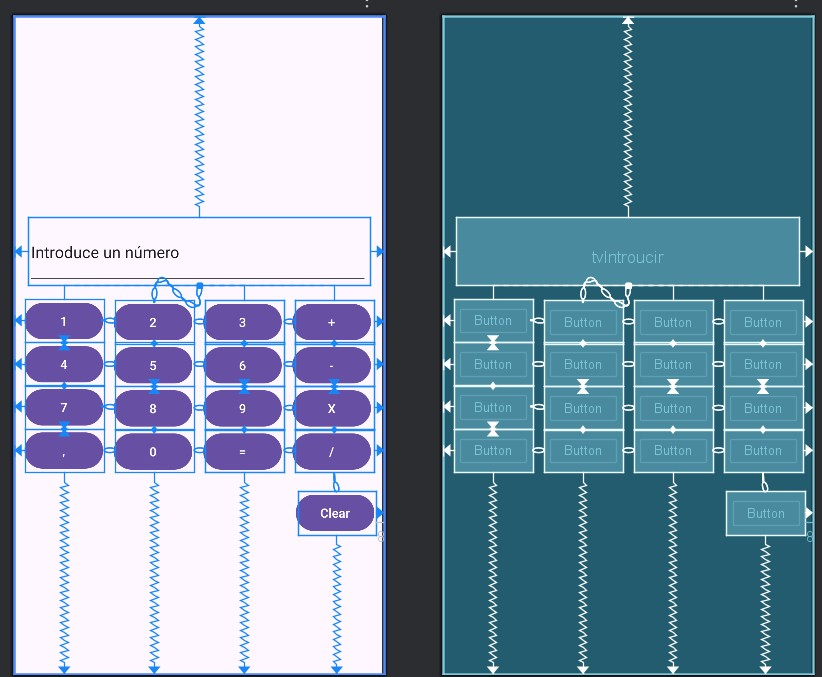
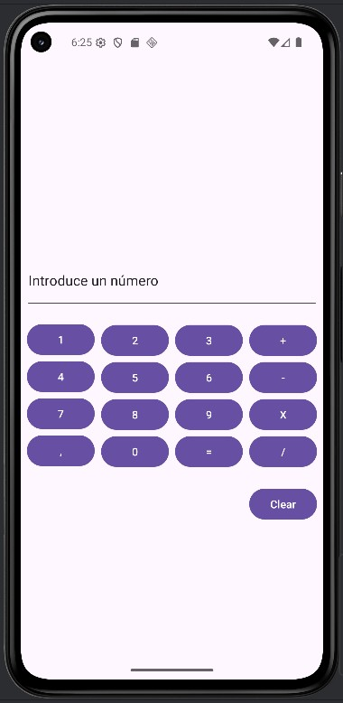

# DOCUMENTACIÓN CALCULADORA
## ÍNDICE

---

**1. [Comentarios interesantes / Problemas](#1-comentarios-interesantes--problemas)**  
**2. [Diseño de la Aplicación](#2-diseño-de-la-aplicación)**  
**3. [Ejecución de la Aplicación](#3-ejecución-de-la-aplicación)**  
**4. [Código XML](#4-código-xml)**

---

## 1. Comentarios interesantes / Problemas

LOS PROBLEMAS QUE HE TENIDO HAN SIDO:

- ME RESULTÓ COMPLICADO Y TUVE PROBLEMAS EN ALINEARLO VERTICALMENTE YA QUE LOS BOTONES SE DESCOLOCABAN TODOS.
- TAMBIÉN CUANDO CONSEGUÍA ALINEARLOS SE JUNTABAN TODOS DEMASIADO ABAJO Y TUVE QUE AÑADIR UNA LÍNEA DE CÓDIGO  app:layout_constraintVertical_bias="0.0" 
  EN EL BOTÓN QUE TENÍA PACKED.

---

## 2. DISEÑO DE LA APLICACIÓN

---
## 3. EJECUCIÓN DE LA APLICACIÓN

---
## 4. Código XML 
<?xml version="1.0" encoding="utf-8"?>
<androidx.constraintlayout.widget.ConstraintLayout xmlns:android="http://schemas.android.com/apk/res/android"
    xmlns:app="http://schemas.android.com/apk/res-auto"
    xmlns:tools="http://schemas.android.com/tools"
    android:id="@+id/main"
    android:layout_width="match_parent"
    android:layout_height="match_parent"
    tools:context=".MainActivity">

    <Button
        android:id="@+id/button16"
        android:layout_width="wrap_content"
        android:layout_height="wrap_content"
        android:text="@string/Boton0"
        app:layout_constraintBottom_toBottomOf="parent"
        app:layout_constraintEnd_toStartOf="@+id/button15"
        app:layout_constraintHorizontal_bias="0.5"
        app:layout_constraintStart_toEndOf="@+id/button14"
        app:layout_constraintTop_toBottomOf="@+id/tvBoton8" />

    <Button
        android:id="@+id/button14"
        android:layout_width="wrap_content"
        android:layout_height="wrap_content"
        android:text="@string/Boton_coma"
        app:layout_constraintBottom_toBottomOf="parent"
        app:layout_constraintEnd_toStartOf="@+id/button16"
        app:layout_constraintHorizontal_bias="0.5"
        app:layout_constraintStart_toStartOf="parent"
        app:layout_constraintTop_toBottomOf="@+id/tvBoton7" />

    <Button
        android:id="@+id/button15"
        android:layout_width="wrap_content"
        android:layout_height="wrap_content"
        android:text="@string/Boton_igual"
        app:layout_constraintBottom_toBottomOf="parent"
        app:layout_constraintEnd_toStartOf="@+id/tvBoton_Divi"
        app:layout_constraintHorizontal_bias="0.5"
        app:layout_constraintStart_toEndOf="@+id/button16"
        app:layout_constraintTop_toBottomOf="@+id/tvBoton9" />

    <Button
        android:id="@+id/tvBoton_Divi"
        android:layout_width="wrap_content"
        android:layout_height="wrap_content"
        android:text="@string/Boton_Dividir"
        app:layout_constraintBottom_toTopOf="@+id/tvBoton_Clear"
        app:layout_constraintEnd_toEndOf="parent"
        app:layout_constraintHorizontal_bias="0.5"
        app:layout_constraintStart_toEndOf="@+id/button15"
        app:layout_constraintTop_toBottomOf="@+id/tvBoton_multi" />

    <Button
        android:id="@+id/tvBoton8"
        android:layout_width="wrap_content"
        android:layout_height="wrap_content"
        android:text="@string/Boton8"
        app:layout_constraintBottom_toTopOf="@+id/button16"
        app:layout_constraintEnd_toStartOf="@+id/tvBoton9"
        app:layout_constraintHorizontal_bias="0.5"
        app:layout_constraintStart_toEndOf="@+id/tvBoton7"
        app:layout_constraintTop_toBottomOf="@+id/tvBoton5" />

    <Button
        android:id="@+id/tvBoton_multi"
        android:layout_width="wrap_content"
        android:layout_height="wrap_content"
        android:text="@string/Boton_Multi"
        app:layout_constraintBottom_toTopOf="@+id/tvBoton_Divi"
        app:layout_constraintEnd_toEndOf="parent"
        app:layout_constraintHorizontal_bias="0.5"
        app:layout_constraintStart_toEndOf="@+id/tvBoton9"
        app:layout_constraintTop_toBottomOf="@+id/tvBoton_Resta" />

    <Button
        android:id="@+id/tvBoton7"
        android:layout_width="wrap_content"
        android:layout_height="wrap_content"
        android:text="@string/Boton7"
        app:layout_constraintBottom_toTopOf="@+id/button14"
        app:layout_constraintEnd_toStartOf="@+id/tvBoton8"
        app:layout_constraintHorizontal_bias="0.5"
        app:layout_constraintStart_toStartOf="parent"
        app:layout_constraintTop_toBottomOf="@+id/tvBoton4" />

    <Button
        android:id="@+id/tvBoton9"
        android:layout_width="wrap_content"
        android:layout_height="wrap_content"
        android:text="@string/Boton9"
        app:layout_constraintBottom_toTopOf="@+id/button15"
        app:layout_constraintEnd_toStartOf="@+id/tvBoton_multi"
        app:layout_constraintHorizontal_bias="0.5"
        app:layout_constraintStart_toEndOf="@+id/tvBoton8"
        app:layout_constraintTop_toBottomOf="@+id/tvBoton6" />

    <Button
        android:id="@+id/tvBoton5"
        android:layout_width="wrap_content"
        android:layout_height="wrap_content"
        android:text="@string/Boton5"
        app:layout_constraintBottom_toTopOf="@+id/tvBoton8"
        app:layout_constraintEnd_toStartOf="@+id/tvBoton6"
        app:layout_constraintHorizontal_bias="0.5"
        app:layout_constraintStart_toEndOf="@+id/tvBoton4"
        app:layout_constraintTop_toBottomOf="@+id/tvBoton2" />

    <Button
        android:id="@+id/tvBoton_Resta"
        android:layout_width="wrap_content"
        android:layout_height="wrap_content"
        android:text="@string/Boton_Resta"
        app:layout_constraintBottom_toTopOf="@+id/tvBoton_multi"
        app:layout_constraintEnd_toEndOf="parent"
        app:layout_constraintHorizontal_bias="0.5"
        app:layout_constraintStart_toEndOf="@+id/tvBoton6"
        app:layout_constraintTop_toBottomOf="@+id/tvBoton_Suma" />

    <Button
        android:id="@+id/tvBoton4"
        android:layout_width="wrap_content"
        android:layout_height="wrap_content"
        android:text="@string/Boton4"
        app:layout_constraintBottom_toTopOf="@+id/tvBoton7"
        app:layout_constraintEnd_toStartOf="@+id/tvBoton5"
        app:layout_constraintHorizontal_bias="0.5"
        app:layout_constraintStart_toStartOf="parent"
        app:layout_constraintTop_toBottomOf="@+id/tvBoton1" />

    <Button
        android:id="@+id/tvBoton6"
        android:layout_width="wrap_content"
        android:layout_height="wrap_content"
        android:text="@string/Boton6"
        app:layout_constraintBottom_toTopOf="@+id/tvBoton9"
        app:layout_constraintEnd_toStartOf="@+id/tvBoton_Resta"
        app:layout_constraintHorizontal_bias="0.5"
        app:layout_constraintStart_toEndOf="@+id/tvBoton5"
        app:layout_constraintTop_toBottomOf="@+id/tvBoton3" />

    <Button
        android:id="@+id/tvBoton1"
        android:layout_width="wrap_content"
        android:layout_height="wrap_content"
        android:layout_marginTop="15dp"
        android:text="@string/Boton1"
        app:layout_constraintBottom_toTopOf="@+id/tvBoton4"
        app:layout_constraintEnd_toStartOf="@+id/tvBoton2"
        app:layout_constraintHorizontal_bias="0.5"
        app:layout_constraintStart_toStartOf="parent"
        app:layout_constraintTop_toBottomOf="@+id/editTextText"
        app:layout_constraintVertical_bias="0.0"
        app:layout_constraintVertical_chainStyle="packed" />

    <Button
        android:id="@+id/tvBoton2"
        android:layout_width="wrap_content"
        android:layout_height="wrap_content"
        android:text="@string/Boton2"
        app:layout_constraintBottom_toTopOf="@+id/tvBoton5"
        app:layout_constraintEnd_toStartOf="@+id/tvBoton3"
        app:layout_constraintHorizontal_bias="0.5"
        app:layout_constraintStart_toEndOf="@+id/tvBoton1"
        app:layout_constraintTop_toBottomOf="@+id/editTextText" />

    <Button
        android:id="@+id/tvBoton3"
        android:layout_width="wrap_content"
        android:layout_height="wrap_content"
        android:layout_marginTop="16dp"
        android:text="@string/Boton3"
        app:layout_constraintBottom_toTopOf="@+id/tvBoton6"
        app:layout_constraintEnd_toStartOf="@+id/tvBoton_Suma"
        app:layout_constraintHorizontal_bias="0.5"
        app:layout_constraintStart_toEndOf="@+id/tvBoton2"
        app:layout_constraintTop_toBottomOf="@+id/editTextText"
        app:layout_constraintVertical_bias="0.0"
        app:layout_constraintVertical_chainStyle="packed" />

    <Button
        android:id="@+id/tvBoton_Suma"
        android:layout_width="wrap_content"
        android:layout_height="wrap_content"
        android:layout_marginTop="16dp"
        android:text="@string/Boton_Suma"
        app:layout_constraintBottom_toTopOf="@+id/tvBoton_Resta"
        app:layout_constraintEnd_toEndOf="parent"
        app:layout_constraintHorizontal_bias="0.5"
        app:layout_constraintStart_toEndOf="@+id/tvBoton3"
        app:layout_constraintTop_toBottomOf="@+id/editTextText"
        app:layout_constraintVertical_bias="0.0"
        app:layout_constraintVertical_chainStyle="packed" />

    <EditText
        android:id="@+id/editTextText"
        android:layout_width="381dp"
        android:layout_height="75dp"
        android:layout_marginBottom="16dp"
        android:ems="10"
        android:inputType="text"
        android:text="Name"
        app:layout_constraintBottom_toTopOf="@+id/tvBoton2"
        app:layout_constraintEnd_toEndOf="parent"
        app:layout_constraintStart_toStartOf="parent"
        app:layout_constraintTop_toTopOf="parent"
        app:layout_constraintVertical_chainStyle="packed" />

    <Button
        android:id="@+id/tvBoton_Clear"
        android:layout_width="wrap_content"
        android:layout_height="wrap_content"
        android:layout_marginTop="20dp"
        android:layout_marginEnd="8dp"
        android:text="@string/Boton_Clear"
        app:layout_constraintBottom_toBottomOf="parent"
        app:layout_constraintEnd_toEndOf="parent"
        app:layout_constraintTop_toBottomOf="@+id/tvBoton_Divi" />

</androidx.constraintlayout.widget.ConstraintLayout>